# 🌐 AppSphere: Gateway API Implementation Guide

This guide covers the modern networking architecture of the AppSphere chart, utilizing the **Kubernetes Gateway API** to provide expressive, role-oriented, and extensible service networking.

---

## 🌟 Why Gateway API?

*   **Role-Oriented**: Clearly separates responsibilities between Cluster Operators (Gateways) and Application Developers (Routes).
*   **Expressive Native Controls**: Built-in support for header matching, traffic splitting, and weighted backends without complex annotations.
*   **Future-Proof**: The evolved successor to the legacy Ingress API.

---

## 🏗️ Prerequisites: Gateway Controller

This chart requires a Gateway Controller to provision the underlying load balancer. We recommend **NGINX Gateway Fabric**.

### 📥 Installation Steps

1.  **Install Gateway API CRDs**:
    ```bash
    kubectl apply -f https://github.com/kubernetes-sigs/gateway-api/releases/download/v1.0.0/standard-install.yaml
    ```

2.  **Install NGINX Gateway Controller**:
    ```bash
    helm install nginx-gateway oci://ghcr.io/nginxinc/charts/nginx-gateway-fabric --create-namespace -n nginx-gateway
    ```

3.  **Verify GatewayClass**:
    ```bash
    kubectl get gatewayclass  # Output should show 'nginx'
    ```

---

## 📂 Chart Structure

Verified chart structure for AppSphere Gateway implementation:

```text
├── appsphere/
│   ├── Chart.yaml
│   ├── templates/
│   │   ├── gateway.yaml
│   │   ├── http-route.yaml
│   │   └── ...
│   ├── values/
│   └── values.yaml
└── scripts/
    ├── generate-kubeconfig.sh
    └── setup-user.sh
```

---

## 🔄 Traffic Flow Architecture

The Gateway API functions through a modular hierarchy of resources:

```mermaid
graph TD
    Client80([User Request HTTP:80]) --> LB80[Load Balancer]
    Client443([User Request HTTPS:443]) --> LB443[Load Balancer]
    
    subgraph "Gateway Listeners"
        LB80 --> ListenerHTTP[HTTP Listener]
        LB443 --> ListenerHTTPS[HTTPS Listener]
    end
    
    subgraph "Routing & Redirection"
        ListenerHTTP -- "sslRedirect: true" --> Redirect[HTTPRoute: Redirect to HTTPS]
        ListenerHTTPS --> RouteHTTPS[HTTPRoute: Application Traffic]
    end
    
    subgraph "Backend Services"
        RouteHTTPS --> Svc1[Backend Service 🔵]
        RouteHTTPS --> Svc2[Backend Service 🟢]
    end
```



---

## ⚙️ Configuration

Configure the Gateway in `values.yaml` under the `gateway` section.

### 1. Enable Gateway
```yaml
gateway:
  enabled: true
  name: demo-gateway
```

### 2. Define Listeners & Routes
Routes are defined directly under their respective listeners for centralized management.

```yaml
gateway:
  listeners:
    primary:                 # Map key used for deep merges
      host: api.example.com
      port: 443
      protocol: HTTPS
      tls: tls-secret-name
      sslRedirect: true      # Enables HTTP -> HTTPS redirection
      
      routes:
        web:                 # Map key for routes
          path: /v1
          pathType: PathPrefix
          backendRefs:
            primary:         # Map key for backendRefs
              name: my-service
              port: 80
              weight: 100
```

---

## ✅ Verification & Debugging

Verify the status of your networking stack:

```bash
# 1. Check if Gateway is programmed and ready
kubectl get gateway -n <namespace>

# 2. Check if HTTPRoutes are accepted by the controller
kubectl get httproute -n <namespace>

# 3. View detailed status and events
kubectl describe gateway <gateway-name> -n <namespace>
```

> [!TIP]
> **Status Conditions**: Always look for `Ready: True` and `Programmed: True` in the status of the Gateway resource. If `Programmed` is false, check your controller logs.
